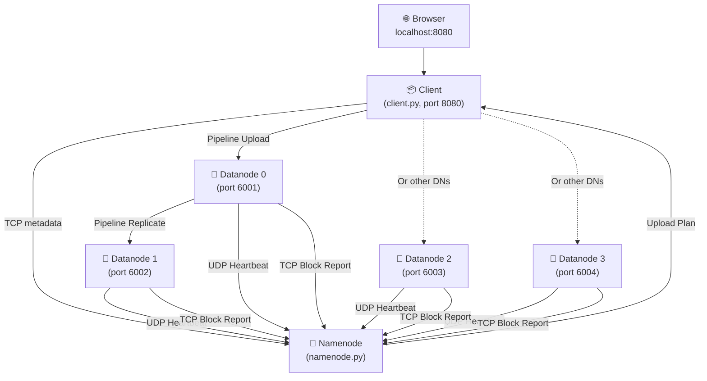
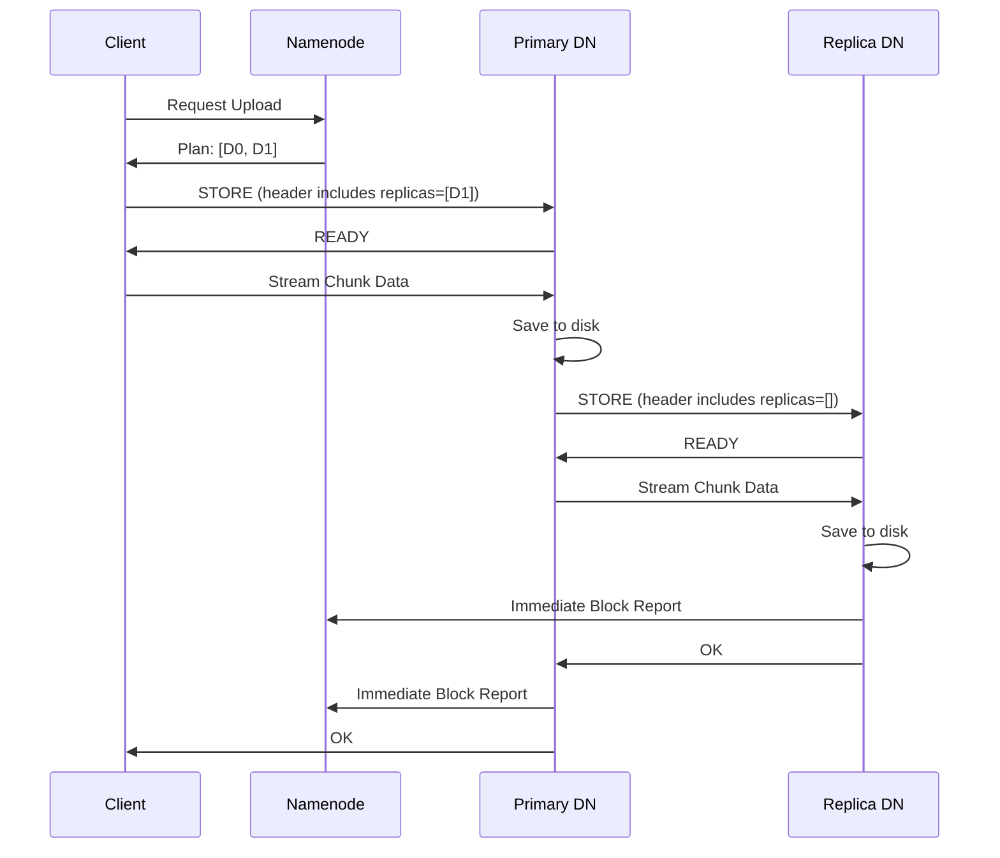
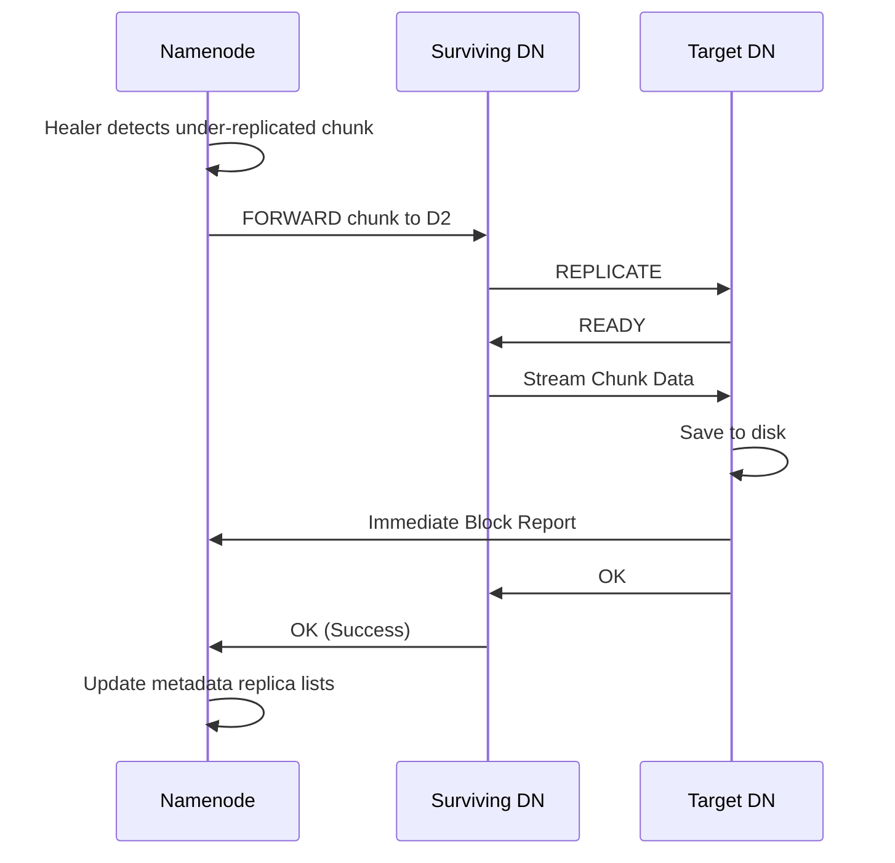

<p align="center">
  
  
  
  
</p>

<h1 align="center">🗄️ Mini HDFS</h1>
<h3 align="center">A Distributed File System Simulation Inspired by Apache Hadoop HDFS</h3>

<p align="center">
  <em>Built from scratch using raw TCP/UDP sockets, multithreading, and a real-time Flask dashboard — no external distributed frameworks used.</em>
</p>

## Highlights

- 🏗️ Built a distributed file system inspired by Apache HDFS
- 📦 Chunk-based distributed storage
- 🔁 Configurable replication with automatic recovery
- 💓 UDP heartbeat monitoring & TCP block reports
- ⚖️ Round-robin load balancing
- 🔄 DataNode-to-DataNode replication
- 🧵 Multithreaded architecture
- 🌐 Real-time Flask dashboard

---

## 📌 What Is This Project?

**Mini HDFS** is an educational distributed file system inspired by Apache HDFS — the backbone of big data storage used by companies like Facebook, Yahoo, and LinkedIn. This project demonstrates core distributed systems concepts by implementing them from the ground up in Python.

### 🎯 The Problem It Solves
In real-world systems, storing large files on a single machine is risky (hardware failure = data loss) and slow (single disk I/O bottleneck). HDFS solves this by:
- **Splitting** files into fixed-size chunks
- **Distributing** chunks across multiple storage nodes
- **Replicating** each chunk for fault tolerance

This project implements the core architectural ideas behind Apache HDFS, including chunking, metadata management, replication, heartbeat monitoring, and failure recovery.

---

## 🏗️ System Architecture



The system consists of **6 independently running processes** communicating over the network:

| Component | Role | Analogy |
|-----------|------|---------|
| **Namenode** | Central metadata controller | The "brain" — knows where every chunk lives |
| **Datanode [0-3]** | 4 Storage worker nodes | Hard drives distributed across multiple racks |
| **Client** | User-facing web app | The interface you interact with |

---

## ✨ Key Features

### 🔪 File Chunking & UUID Tracking
- Files are split into **2 MB chunks** before storage.
- Files are tracked internally via **UUIDs**, completely eliminating filename conflict issues. Two different users can safely upload files named `report.pdf`.
- During download, chunks are retrieved in order and **seamlessly reassembled**.

### 🔁 Pipeline Replication (HDFS Style)
- Replicating data directly from the client is a bottleneck. We implemented **Pipeline Replication**.
- The Client uploads exactly **1 copy** of a chunk to the Primary Datanode. 
- That Datanode automatically pipes the chunk to the next Datanode, drastically reducing client-side network load and matching the exact behavior of Apache HDFS.
- A synchronous `OK` acknowledgment is enforced end-to-end to guarantee data integrity before the pipeline completes.

### 🧠 Smart Load Balancing
- Chunk placement does not blindly dump data onto the same nodes.
- Uses a round-robin placement algorithm to distribute chunks across available DataNodes (e.g., `Chunk0 -> DN0/DN1`, `Chunk1 -> DN2/DN3`, `Chunk2 -> DN1/DN2`).

### 💓 Heartbeat Monitoring & Block Reports
- Datanodes send **UDP heartbeat packets** every 3 seconds.
- The Namenode tracks heartbeats and marks nodes as **[DOWN]** after a 10-second timeout.
- Datanodes send **TCP Block Reports** automatically to keep the Namenode's memory perfectly synchronized with actual disk state.

### 🩹 True Physical Self-Healing
- A background **replication healer** thread monitors the system.
- If a Datanode dies, the replication factor drops. The Namenode detects this and **orchestrates recovery**.
- The Namenode opens a TCP connection to a surviving Datanode and issues a `FORWARD` command.
- The surviving Datanode opens a direct socket to a healthy target node and copies the chunk over the network. The Namenode *never* touches the file data itself.

### 📊 Real-Time Web Dashboard
- Beautiful **dark-themed dashboard** built with HTML/CSS/JS.
- Upload files via **drag-and-drop**.
- One-click file download using internal UUIDs.
- Live **Datanode health monitoring** with online/offline pulsing indicators.
- **System logs panel** with terminal-style auto-scrolling feed.

---

## 🛠️ Technical Deep Dive

### Custom Network Protocol
All inter-process communication uses a **custom framed JSON protocol** over TCP:
```
┌──────────────────────────────────┐
│ 4 bytes (big-endian uint32)      │  ← Length of JSON payload
├──────────────────────────────────┤
│ JSON payload (UTF-8 encoded)     │  ← The actual message
└──────────────────────────────────┘
```

### Data Flow: Pipeline Upload



### Data Flow: True Physical Healing



---

## 🚀 Getting Started

### Prerequisites
- **Python 3.8+**
- **Flask** (`pip install flask`)

### Running the System
Open **6 separate terminals** and run each component:

```bash
# Terminal 1 — Start the Namenode
cd Namenode && python namenode.py

# Terminals 2 to 5 — Start the Datanodes
cd DATANODE0 && python datanode0.py
cd Datanode1 && python datanode1.py
cd DATANODE2 && python datanode2.py
cd DATANODE3 && python datanode3.py

# Terminal 6 — Start the Client Dashboard
cd Client && python client.py
```

Open your browser at **http://localhost:8080** 🎉

### Testing Fault Tolerance
1. Upload a file.
2. **Kill Datanode 0**. Watch the dashboard mark it ❌ **Offline**.
3. **Download the file** — it succeeds seamlessly using surviving replicas.
4. Watch the Namenode terminal. You will see it orchestrate a **Pipeline Recovery**, instructing another Datanode to physically transfer the missing data to a healthy node!

---

## ⚙️ Configuration
All settings are in `config.json` (and synchronized to the component folders):

| Setting | Default | Description |
|---------|---------|-------------|
| `replication_factor` | `2` | Number of copies per chunk |
| `chunk_size_mb` | `2` | Maximum chunk size in MB |
| `heartbeat_interval_sec` | `3` | Datanode heartbeat frequency |
| `heartbeat_timeout_sec` | `10` | Timeout before node is marked dead |

---

## 🧠 Distributed Systems Concepts Demonstrated

| Concept | How It's Implemented |
|---------|---------------------|
| **Data Partitioning** | Files split into fixed 2MB chunks. |
| **Metadata Management** | Centralized NameNode tracks chunk locations and replica information. |
| **Pipeline Replication** | Chunks stream sequentially across the cluster to minimize client bottlenecks. |
| **Smart Load Balancing** | Placement algorithm sprays chunks evenly across 4 independent Datanodes. |
| **UUID Identification** | Complete decoupling of underlying physical storage IDs from user-facing names. |
| **Self-Healing** | Background orchestrator orchestrates physical node-to-node transfers. |
| **Block Reports** | Instant state reconciliation after successful writes. |
| **Custom Wire Protocol** | TCP framed JSON streams and UDP heartbeats. |
| **Consistency** | Thread-safe locks and synchronous end-to-end `OK` pipeline acknowledgments. |

---

## ⚠️ Current Limitations

This project intentionally simplifies some production HDFS features:

- Single NameNode (single point of failure)
- No Secondary NameNode / High Availability
- No Rack-Aware Replica Placement
- No Authentication or Authorization
- No Erasure Coding
- Educational-scale cluster

---

<p align="center">
  <strong>⭐ If you found this project interesting, consider giving it a star!</strong>
</p>
