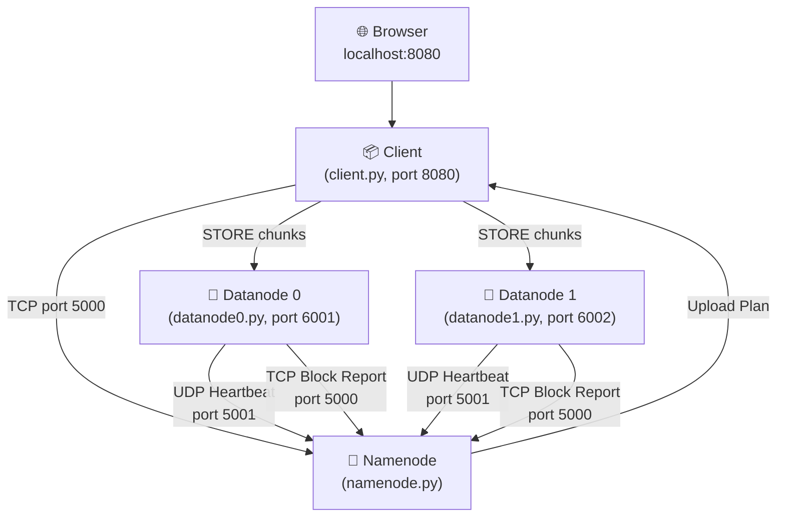
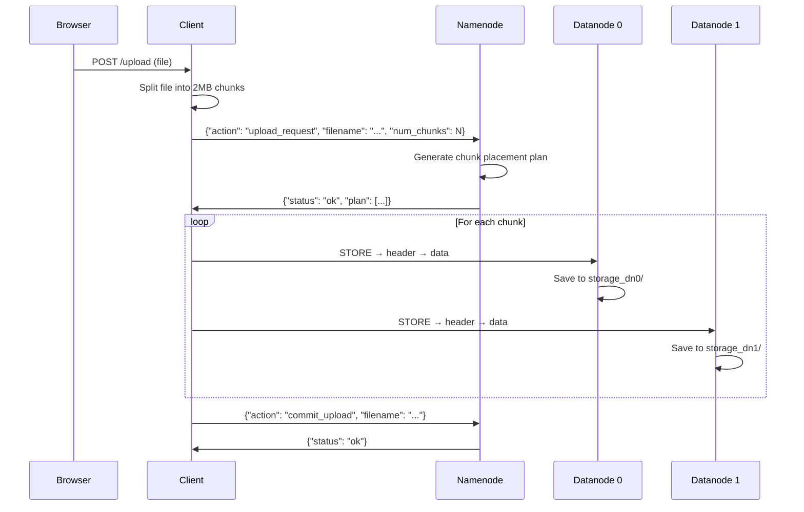
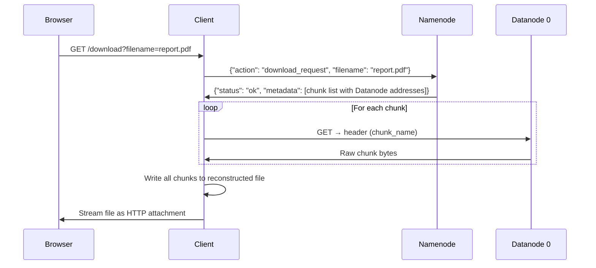
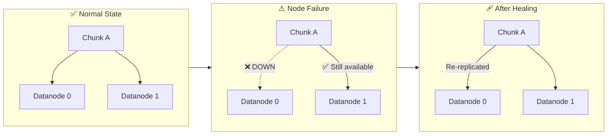

<p align="center">
  
  
  
  
</p>

<h1 align="center">🗄️ Mini HDFS</h1>
<h3 align="center">A Distributed File System Simulation Inspired by Apache Hadoop HDFS</h3>

<p align="center">
  <em>Built from scratch using raw TCP/UDP sockets, multithreading, and a real-time Flask dashboard — no external distributed frameworks used.</em>
</p>

---

## 📌 What Is This Project?

**Mini HDFS** is a fully functional simulation of the **Hadoop Distributed File System (HDFS)** — the backbone of big data storage used by companies like Facebook, Yahoo, and LinkedIn. This project demonstrates core distributed systems concepts by implementing them from the ground up in Python.

### 🎯 The Problem It Solves
In real-world systems, storing large files on a single machine is risky (hardware failure = data loss) and slow (single disk I/O bottleneck). HDFS solves this by:
- **Splitting** files into fixed-size chunks
- **Distributing** chunks across multiple storage nodes
- **Replicating** each chunk for fault tolerance

This project implements all three of these core principles.

---

## 🏗️ System Architecture



The system consists of **4 independently running processes** communicating over the network — exactly like a real distributed system:

| Component | Role | Analogy |
|-----------|------|---------|
| **Namenode** | Central metadata controller | The "brain" — knows where every chunk lives |
| **Datanode 0** | Storage worker node | A hard drive in a data center rack |
| **Datanode 1** | Storage worker node (replica) | A second hard drive on a different rack |
| **Client** | User-facing web app + file handler | The interface you interact with |

---

## ✨ Key Features

### 🔪 File Chunking & Reconstruction
- Files are split into **2 MB chunks** before storage
- During download, chunks are retrieved in order and **seamlessly reassembled** into the original file
- Supports **any file type** — PDFs, images, videos, archives, etc.

### 🔁 Data Replication (Fault Tolerance)
- Every chunk is stored on **2 different Datanodes** (configurable replication factor)
- If one Datanode goes down, data is still accessible from the replica
- Chunk placement uses an **alternating primary/secondary strategy** for balanced distribution

### 💓 Heartbeat Monitoring
- Datanodes send **UDP heartbeat packets** every 3 seconds
- The Namenode tracks heartbeats and marks nodes as **[DOWN]** after a 10-second timeout
- Dashboard shows **real-time node health** with pulsing status indicators

### 🩹 Automatic Self-Healing
- A background **replication healer** thread runs every 10 seconds
- Detects **under-replicated chunks** (fewer copies than the replication factor)
- Automatically schedules **re-replication** to healthy nodes
- Cleans up stale metadata for files with no live replicas

### 📊 Real-Time Web Dashboard
- Beautiful **dark-themed dashboard** built with HTML/CSS/JS
- Upload files via **drag-and-drop** or file picker
- One-click file download with automatic reconstruction
- Live **Datanode health monitoring** with online/offline indicators
- **System logs panel** with terminal-style auto-scrolling feed
- Auto-refreshes every 3 seconds

### 🔐 Data Integrity
- **MD5 checksums** computed for every chunk during upload and download
- Datanodes verify checksum integrity before accepting or serving data
- Corrupted transfers are **rejected** and logged

---

## 🛠️ Technical Deep Dive

### Custom Network Protocol

All inter-process communication uses a **custom framed JSON protocol** over TCP:

```
┌──────────────────────────────────┐
│ 4 bytes (big-endian uint32)      │  ← Length of JSON payload
├──────────────────────────────────┤
│ JSON payload (UTF-8 encoded)     │  ← The actual message
└──────────────────────────────────┘
```

Heartbeats are the exception — they use **UDP** for lightweight, fire-and-forget health checks.

### Chunk Storage Protocol (Datanode ↔ Client)

```
Client → Datanode:  STORE\n → [4-byte header length] → [JSON header] → Datanode replies READY → [raw chunk bytes]
Client → Datanode:  GET\n   → [4-byte header length] → [JSON header] → Datanode sends back [raw chunk bytes]
```

### Data Flow: Upload



### Data Flow: Download



---

## 🧵 Concurrency Model

The system uses **Python threading** extensively to simulate real distributed processes:

| Component | Threads | Purpose |
|-----------|---------|---------|
| **Namenode** | 4 background threads | Client listener, heartbeat listener, heartbeat monitor, replication healer |
| **Datanode 0** | 3 threads | Chunk server (TCP), heartbeat sender (UDP), block report sender |
| **Datanode 1** | 3 threads | Same as Datanode 0 |
| **Client** | 2+ threads | Flask web server + background upload threads |

All shared state is protected with **`threading.Lock`** to prevent race conditions.

---

## 📁 Project Structure

```
mini_hdfs/
├── config.json                    # Shared configuration (ports, replication factor, etc.)
├── README.md                      # You are here
├── project_description.md         # Detailed internal technical documentation
│
├── Namenode/
│   ├── config.json                # Namenode's config copy
│   ├── namenode.py                # Master node — metadata, heartbeats, healing (385 lines)
│   └── metadata.json              # Persistent file/chunk registry (auto-generated)
│
├── DATANODE0/
│   ├── config.json                # Datanode 0's config copy
│   ├── datanode0.py               # Storage node 0 — chunk store/retrieve (191 lines)
│   └── storage_dn0/               # Binary chunk files stored here
│
├── Datanode1/
│   ├── config.json                # Datanode 1's config copy
│   ├── datanode1.py               # Storage node 1 — with checksum verification (202 lines)
│   └── storage_dn1/               # Binary chunk files stored here
│
└── Client/
    ├── config.json                # Client's config copy
    └── client.py                  # Flask dashboard + upload/download engine (788 lines)
```

---

## 🚀 Getting Started

### Prerequisites
- **Python 3.8+**
- **Flask** (`pip install flask`)

### Running the System

Open **4 separate terminals** and run each component (order matters):

```bash
# Terminal 1 — Start the Namenode (must be first)
cd Namenode
python namenode.py

# Terminal 2 — Start Datanode 0
cd DATANODE0
python datanode0.py

# Terminal 3 — Start Datanode 1
cd Datanode1
python datanode1.py

# Terminal 4 — Start the Client Dashboard
cd Client
python client.py
```

Then open your browser at **http://localhost:8080** 🎉

### Testing Fault Tolerance
1. Upload a file through the dashboard
2. **Kill Datanode 0** (Ctrl+C in Terminal 2)
3. Watch the dashboard show Datanode 0 as ❌ **Offline**
4. **Download the same file** — it works because the replica exists on Datanode 1
5. Restart Datanode 0 — the healer will re-replicate any under-replicated chunks

---

## ⚙️ Configuration

All settings are centralized in `config.json`:

| Setting | Default | Description |
|---------|---------|-------------|
| `replication_factor` | `2` | Number of copies per chunk |
| `chunk_size_mb` | `2` | Maximum chunk size in MB |
| `heartbeat_interval_sec` | `3` | Datanode heartbeat frequency |
| `heartbeat_timeout_sec` | `10` | Seconds before a silent Datanode is marked dead |
| `namenode.client_port` | `5000` | TCP port for Namenode ↔ Client communication |
| `namenode.heartbeat_port` | `5001` | UDP port for heartbeat signals |
| `datanodes.dn0.port` | `6001` | TCP port for Datanode 0 |
| `datanodes.dn1.port` | `6002` | TCP port for Datanode 1 |

---

## 🧠 Distributed Systems Concepts Demonstrated

| Concept | How It's Implemented |
|---------|---------------------|
| **Data Partitioning (Sharding)** | Files split into fixed-size 2 MB chunks distributed across nodes |
| **Replication** | Each chunk stored on 2 Datanodes with alternating primary/secondary placement |
| **Failure Detection** | UDP heartbeat mechanism with configurable timeout |
| **Self-Healing** | Background replication healer detects and fixes under-replicated data |
| **Metadata Management** | Centralized Namenode with persistent JSON-backed metadata store |
| **Block Reports** | Datanodes periodically scan local storage and report inventory to Namenode |
| **Client-Server Architecture** | Multi-tier: Browser → Flask Client → Namenode → Datanodes |
| **Custom Wire Protocol** | Length-prefixed framed JSON over TCP, UDP for heartbeats |
| **Consistency** | Thread-safe shared state with mutex locks |
| **Data Integrity** | MD5 checksums verified on every chunk transfer |
| **Graceful Degradation** | System continues serving files even when nodes fail |

---

## 🛡️ How Fault Tolerance Works



---

## 📊 Dashboard Preview

The web dashboard provides a **real-time control center** for the distributed file system:

| Section | What It Shows |
|---------|--------------|
| **Status Cards** | Live count of online Datanodes, total files, chunk size, replication factor |
| **Upload Panel** | Drag-and-drop file upload with progress feedback |
| **Download Panel** | Enter filename to download reconstructed file |
| **Datanode Health** | Each node with pulsing green (online) or red (offline) indicators |
| **Stored Files** | Lists healthy files with one-click download buttons |
| **System Logs** | Terminal-style live log feed, auto-scrolling, refreshes every 3 seconds |

---

## 🔮 Future Enhancements

- [ ] Add more Datanodes (dynamic scaling)
- [ ] Implement rack-awareness for replica placement
- [ ] Add file deletion support
- [ ] Implement Namenode HA (High Availability) with a secondary Namenode
- [ ] Add chunk-level encryption
- [ ] Dockerize each component for true distributed deployment
- [ ] Implement data balancer for storage equalization

---

## 📚 Tech Stack

| Layer | Technology |
|-------|-----------|
| **Language** | Python 3 |
| **Networking** | Raw TCP/UDP sockets (`socket` module) |
| **Concurrency** | `threading` module with mutex locks |
| **Web Framework** | Flask |
| **Frontend** | HTML5, CSS3 (custom dark theme), Vanilla JavaScript |
| **Data Format** | JSON (wire protocol + metadata persistence) |
| **Integrity** | MD5 checksums (`hashlib`) |

---

<p align="center">
  <strong>⭐ If you found this project interesting, consider giving it a star!</strong>
</p>
