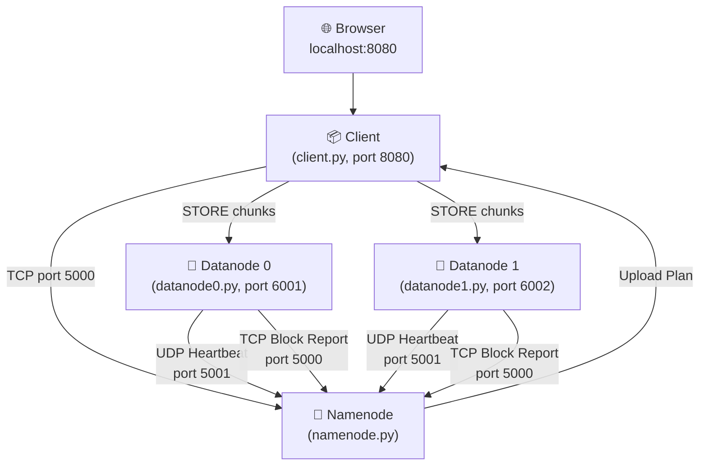
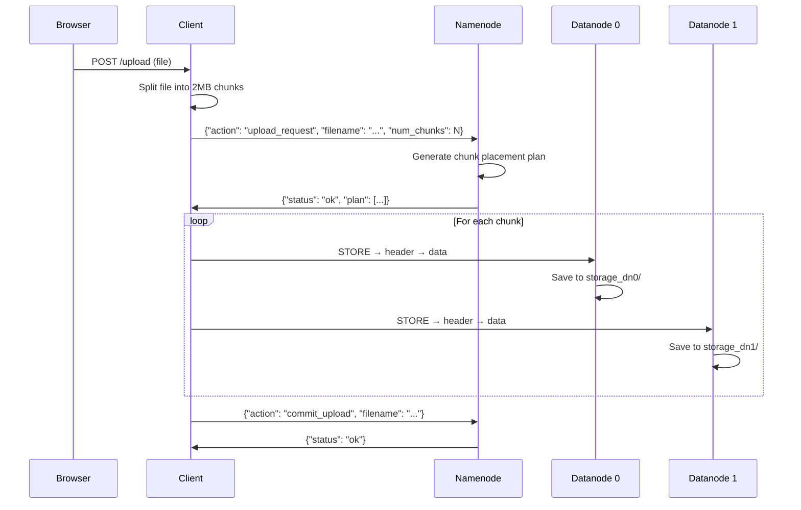
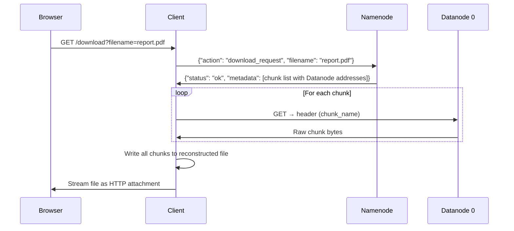

# Mini HDFS — Complete Project File Descriptions

## Project Overview

This project simulates a miniature **Hadoop Distributed File System (HDFS)**. It splits files into fixed-size chunks (2 MB), replicates them across multiple storage nodes for fault tolerance, and provides a web dashboard to upload, download, and monitor files.



---

## Configuration Files

### [config.json](file:///c:/Users/retes/Desktop/mini_hdfs/config.json) (Root + each subfolder)

Every node folder (`Namenode/`, `DATANODE0/`, `Datanode1/`, `Client/`) contains an identical `config.json`. Each process loads its own local copy at startup.

| Field | Value | Purpose |
|-------|-------|---------|
| `namenode.host` | `127.0.0.1` | IP address of the Namenode |
| `namenode.client_port` | `5000` | TCP port for client ↔ Namenode communication |
| `namenode.heartbeat_port` | `5001` | UDP port for Datanode heartbeat signals |
| `datanodes.dn0.host` | `127.0.0.1` | IP of Datanode 0 |
| `datanodes.dn0.port` | `6001` | TCP port for Datanode 0 chunk storage/retrieval |
| `datanodes.dn0.storage_dir` | `./storage_dn0` | Local folder where Datanode 0 saves chunks |
| `datanodes.dn1.host` | `127.0.0.1` | IP of Datanode 1 |
| `datanodes.dn1.port` | `6002` | TCP port for Datanode 1 chunk storage/retrieval |
| `datanodes.dn1.storage_dir` | `./storage_dn1` | Local folder where Datanode 1 saves chunks |
| `replication_factor` | `2` | How many copies of each chunk to store |
| `chunk_size_mb` | `2` | Maximum chunk size in MB |
| `heartbeat_interval_sec` | `3` | How often Datanodes send heartbeats (seconds) |
| `heartbeat_timeout_sec` | `10` | After this many seconds without a heartbeat, the Namenode considers a Datanode dead |

---

## Namenode — [Namenode/namenode.py](file:///c:/Users/retes/Desktop/mini_hdfs/Namenode/namenode.py)

> **Role:** The central controller / master node. It manages all metadata, decides where chunks go, monitors node health, and handles all client requests.

### Startup Flow
1. Loads `config.json` → reads ports, Datanode addresses, replication factor.
2. Loads `metadata.json` → restores previous file/chunk mappings from disk.
3. Starts **4 background threads** and keeps the main thread alive.

### Background Threads

| Thread | Function | Port/Interval | What it does |
|--------|----------|---------------|-------------|
| `client_listener` | [L291-L299](file:///c:/Users/retes/Desktop/mini_hdfs/Namenode/namenode.py#L291-L299) | TCP `5000` | Listens for incoming TCP connections from the Client or Datanodes. Spawns a new thread per connection to handle the request. |
| `heartbeat_listener` | [L301-L311](file:///c:/Users/retes/Desktop/mini_hdfs/Namenode/namenode.py#L301-L311) | UDP `5001` | Receives UDP heartbeat packets from Datanodes. Updates the `heartbeat_table` with the current timestamp for each Datanode. |
| `heartbeat_monitor` | [L313-L325](file:///c:/Users/retes/Desktop/mini_hdfs/Namenode/namenode.py#L313-L325) | Every 5 sec | Checks if any Datanode has exceeded the `heartbeat_timeout_sec` (10s). If so, marks it as `[DOWN]` and removes it from `chunk_locations`. |
| `replication_healer` | [L327-L371](file:///c:/Users/retes/Desktop/mini_hdfs/Namenode/namenode.py#L327-L371) | Every 10 sec | Checks if any chunk has fewer live holders than the replication factor. If at least 1 holder exists, it schedules re-replication. Also removes stale metadata for files where zero chunks exist on any Datanode. |

### Client Request Handler — [handle_client](file:///c:/Users/retes/Desktop/mini_hdfs/Namenode/namenode.py#L125-L286)

All requests arrive as **framed JSON messages** over TCP (4-byte big-endian length prefix + JSON body).

| Action | Lines | What it does |
|--------|-------|-------------|
| `upload_request` (alias: `upload`) | [L134-L165](file:///c:/Users/retes/Desktop/mini_hdfs/Namenode/namenode.py#L134-L165) | Receives a filename and number of chunks. Uses `plan_two_replicas()` to decide which Datanodes should store each chunk. Saves metadata to disk. Returns the plan (list of chunk names + target Datanode addresses) to the Client. |
| `commit_upload` | [L168-L176](file:///c:/Users/retes/Desktop/mini_hdfs/Namenode/namenode.py#L168-L176) | Confirms a completed upload. Saves metadata. |
| `download_request` (alias: `download`) | [L179-L209](file:///c:/Users/retes/Desktop/mini_hdfs/Namenode/namenode.py#L179-L209) | Looks up the file's chunk metadata. Filters replicas to prioritize live Datanodes. Returns chunk names and Datanode addresses to the Client. |
| `list_files` | [L212-L215](file:///c:/Users/retes/Desktop/mini_hdfs/Namenode/namenode.py#L212-L215) | Returns a list of all known filenames. |
| `block_report` | [L218-L230](file:///c:/Users/retes/Desktop/mini_hdfs/Namenode/namenode.py#L218-L230) | Receives a report from a Datanode listing all chunks it currently has on disk. Clears old entries for that Datanode and re-registers the reported blocks in `chunk_locations`. |
| `system_status` | [L233-L278](file:///c:/Users/retes/Desktop/mini_hdfs/Namenode/namenode.py#L233-L278) | Returns a JSON response with: (1) each Datanode's alive/dead status, (2) file distribution (which chunks are stored where), (3) file integrity (whether all chunks have at least one live replica). |

### Key Helper — [plan_two_replicas](file:///c:/Users/retes/Desktop/mini_hdfs/Namenode/namenode.py#L110-L120)

Chunk allocation strategy:
- **Even chunk IDs** → Primary = `dn0`, Secondary = `dn1`
- **Odd chunk IDs** → Primary = `dn1`, Secondary = `dn0`
- If only one Datanode is alive, stores on that one only.

### Data Structures (In-Memory)

| Variable | Type | Purpose |
|----------|------|---------|
| `metadata` | `Dict[str, List[Dict]]` | Maps filename → list of chunk records (chunk_id, chunk_name, replicas, size). Persisted to `metadata.json`. |
| `chunk_locations` | `Dict[Tuple[str,int], Set[str]]` | Maps (filename, chunk_id) → set of Datanode IDs that actually hold the chunk (populated by block reports). **In-memory only.** |
| `heartbeat_table` | `Dict[str, float]` | Maps Datanode ID → timestamp of last heartbeat. |
| `state_lock` | `threading.Lock` | Protects all shared state from race conditions. |

### [Namenode/metadata.json](file:///c:/Users/retes/Desktop/mini_hdfs/Namenode/metadata.json)

Persistent JSON file storing file metadata. Automatically saved/loaded by the Namenode. Structure:

```json
{
  "report.pdf": [
    {
      "chunk_id": 0,
      "chunk_name": "report.pdf.chunk0",
      "replicas": [["127.0.0.1", 6001], ["127.0.0.1", 6002]],
      "size": 2097152
    }
  ]
}
```

---

## Datanode 0 — [DATANODE0/datanode0.py](file:///c:/Users/retes/Desktop/mini_hdfs/DATANODE0/datanode0.py)

> **Role:** A storage node that saves, serves, and reports file chunks.

### Startup Flow
1. Loads `config.json` and creates the `storage_dn0/` directory.
2. Starts **3 threads**:

| Thread | Function | What it does |
|--------|----------|-------------|
| `send_heartbeat` | [L42-L51](file:///c:/Users/retes/Desktop/mini_hdfs/DATANODE0/datanode0.py#L42-L51) | Sends a UDP packet containing `"dn0"` to the Namenode every 3 seconds. This tells the Namenode "I'm alive." |
| `send_block_report` | [L142-L179](file:///c:/Users/retes/Desktop/mini_hdfs/DATANODE0/datanode0.py#L142-L179) | Every 10 seconds, scans `storage_dn0/` for chunk files. Parses filenames like `report.pdf.chunk0` to extract the original filename and chunk ID. Sends a TCP message to the Namenode with the full inventory. |
| `listen_for_chunks` | [L54-L139](file:///c:/Users/retes/Desktop/mini_hdfs/DATANODE0/datanode0.py#L54-L139) | Main TCP server on port `6001`. Handles two commands: |

### TCP Commands

| Command | Protocol | What it does |
|---------|----------|-------------|
| **`STORE`** | Client sends: `STORE\n` → 4-byte header length → JSON header (`chunk_name`, `size`) → Datanode replies `READY` → Client sends raw chunk bytes | Receives chunk data, computes MD5 checksum for logging, writes to `storage_dn0/<chunk_name>`. |
| **`GET`** | Client sends: `GET\n` → 4-byte header length → JSON header (`chunk_name`) → Datanode reads the file and sends raw bytes back | Reads the chunk file from disk, verifies checksum if provided, and streams the raw binary data back to the Client. |

### Storage Directory — `DATANODE0/storage_dn0/`

Contains raw binary chunk files. Example contents after uploading `report.pdf` (3 MB):
```
storage_dn0/
├── report.pdf.chunk0    (2 MB)
└── report.pdf.chunk1    (1 MB)
```

---

## Datanode 1 — [Datanode1/datanode1.py](file:///c:/Users/retes/Desktop/mini_hdfs/Datanode1/datanode1.py)

> **Role:** Identical to Datanode 0 but runs on port `6002` and stores chunks in `storage_dn1/`.

### Differences from Datanode 0

| Aspect | Datanode 0 | Datanode 1 |
|--------|-----------|-----------|
| Node ID | `dn0` | `dn1` |
| TCP Port | `6001` | `6002` |
| Storage Directory | `./storage_dn0` | `./storage_dn1` |
| Extra command | — | Also accepts `REPLICATE` (alias for `STORE`, originally designed for Namenode-initiated replication) |
| Checksum verification | Logs checksum only | Actively verifies incoming checksum during `STORE` and rejects corrupted data |

### Threads (same as Datanode 0)

| Thread | What it does |
|--------|-------------|
| `send_heartbeat` | UDP heartbeat every 3 seconds to Namenode |
| `send_block_report` | Disk scan + TCP block report every 10 seconds |
| `listen_for_chunks` | TCP server for `STORE`/`REPLICATE`/`GET` commands |

---

## Client — [Client/client.py](file:///c:/Users/retes/Desktop/mini_hdfs/Client/client.py)

> **Role:** The user-facing component. Provides a Flask web dashboard and handles the actual file chunking, upload, download, and reconstruction logic.

### Core Functions

| Function | Lines | What it does |
|----------|-------|-------------|
| `split_file(filename)` | [L69-L78](file:///c:/Users/retes/Desktop/mini_hdfs/Client/client.py#L69-L78) | Reads a file in 2 MB blocks. Returns a list of raw byte chunks and their MD5 checksums. |
| `send_chunk(host, port, ...)` | [L80-L98](file:///c:/Users/retes/Desktop/mini_hdfs/Client/client.py#L80-L98) | Opens a TCP connection to a Datanode, sends `STORE\n`, sends a JSON header with chunk name and size, waits for `READY`, then streams the raw chunk bytes. |
| `upload_file(filename)` | [L100-L123](file:///c:/Users/retes/Desktop/mini_hdfs/Client/client.py#L100-L123) | **Full upload workflow:** (1) Split file into chunks. (2) Ask Namenode for an upload plan. (3) Send each chunk to each assigned Datanode. (4) Send `commit_upload` to Namenode. |
| `download_file(filename, output)` | [L126-L157](file:///c:/Users/retes/Desktop/mini_hdfs/Client/client.py#L126-L157) | **Full download workflow:** (1) Ask Namenode for chunk metadata. (2) For each chunk, connect to the first listed Datanode and send `GET\n`. (3) Receive raw bytes. (4) Write all chunks sequentially to the output file, reconstructing the original. Returns `None` on success or an error message string on failure. |
| `send_to_namenode(message)` | [L55-L66](file:///c:/Users/retes/Desktop/mini_hdfs/Client/client.py#L55-L66) | Helper that opens a TCP socket to the Namenode, sends a framed JSON request, and returns the framed JSON response. |

### Flask Web Dashboard (port 8080)

| Route | Method | What it does |
|-------|--------|-------------|
| `/` | GET | Serves the HTML dashboard page |
| `/upload` | POST | Receives a file from the browser, saves it locally, starts `upload_file()` in a background thread |
| `/download` | GET/POST | Calls `download_file()` synchronously, then streams the reconstructed file back to the browser as an attachment |
| `/api/status` | GET | Queries the Namenode for `system_status` and returns raw JSON (used by the dashboard JavaScript) |
| `/status` | GET | Alternate status endpoint — returns JSON on success or plain text error message on failure |
| `/logs` | GET | Returns the last 100 log lines as plain text |

### Dashboard UI Features

| Section | What it shows |
|---------|-------------|
| **Status Cards** | Number of online Datanodes, total files, chunk size (2 MB), replication factor (2) |
| **Upload Card** | File picker with drag-and-drop styling, upload button, status feedback |
| **Download Card** | Text input for filename, download button |
| **Datanode Health** | Each node with a pulsing green dot (online) or red dot (offline) |
| **Stored Files** | Lists only healthy files with a one-click Download button |
| **System Logs** | Live scrolling terminal-style log panel, auto-refreshes every 3 seconds |

---

## Communication Protocol Summary

All inter-process communication uses **TCP sockets** with a custom framed JSON protocol:

```
┌──────────────────────────────────┐
│ 4 bytes (big-endian uint32)      │  ← Length of JSON payload
├──────────────────────────────────┤
│ JSON payload (UTF-8 encoded)     │  ← The actual message
└──────────────────────────────────┘
```

Heartbeats are the only exception — they use **UDP** (fire-and-forget, no response needed).

### Data Flow: Upload



### Data Flow: Download



---

## File Structure Summary

```
mini_hdfs/
├── config.json                    # Root config (reference copy)
├── project_description.md         # Project documentation
│
├── Namenode/
│   ├── config.json                # Namenode's config
│   ├── namenode.py                # Master node (385 lines)
│   └── metadata.json              # Persistent file/chunk registry
│
├── DATANODE0/
│   ├── config.json                # Datanode 0's config
│   ├── datanode0.py               # Storage node 0 (191 lines)
│   └── storage_dn0/              # Chunk files stored here
│
├── Datanode1/
│   ├── config.json                # Datanode 1's config
│   ├── datanode1.py               # Storage node 1 (202 lines)
│   └── storage_dn1/              # Chunk files stored here
│
└── Client/
    ├── config.json                # Client's config
    └── client.py                  # Web dashboard + upload/download logic (788 lines)
```
